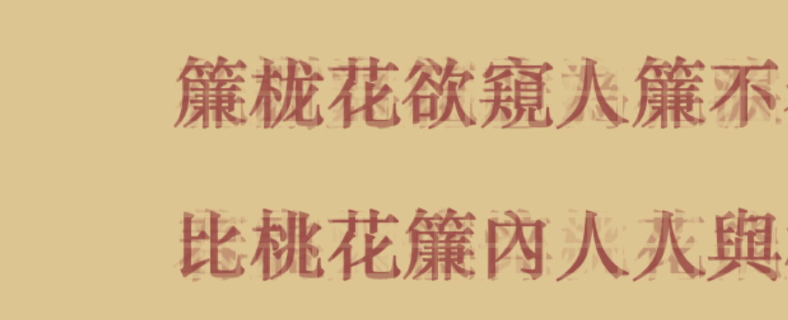

## Fallen Flowers

##### *By Mengxuan ZHAO* &nbsp;&nbsp;&nbsp;&nbsp;&nbsp;&nbsp;&nbsp;&nbsp;&nbsp;&nbsp; *2021.03*

### View the Artwork [Fallen Flowers](https://mx-zhao.github.io/fallenflower/)

 
 

## Brief Introduction

Fallen Flower is a digital writing work generated by a self-written n-gram system that fit with Chinese language, which consists of single characters.

The system has two original writing sources, both written by ancient Chinese poets:

The first one is ***Fallen Flowers***, written by *Li Qingzhao*, a female poet born in 1084. Received comprehensive education in her childhood, she wrote about the twists and turns in her life as a female.

The second is ***The Song of Peach Blossom*** by *Cao Xueqin*, a male novel writer born in 1715, who had been writing about the stories of women during his whole life.

The two works are from two different perspectives of male and female writers. However, both of the sources focus on the same topic, which is to compared the aging of women and the loss of beauty to fallen flowers. The fast changing speed and the trace of the previous group of words left on the background indicate this idea. In both of the works, there’s a huge number of Chinese character “花”, which stands for “flower”. The repeating of this single character makes it possible to setup this n-gram system with a rather short source text.

The characters are in the color of *Yanzhi(胭脂)*, which is a cosmetic made from flowers to color the lips red. And the background is in the style of ancient Chinese calligraphy paper.

## About the artist

#### Mengxuan ZHAO
Year 4 student of City University of Hong Kong, School of Creative Media. Major in New Media and minor in Asian and International Studies. My background offered me a perspective to reflect on ancient Chinese literatures and combine my understandings with coding techniques to create this work.

*Special thanks to professor Daniel Howe for instructions during the past semester, as well as my friends and classmates who kindly offered their suggestions.*

